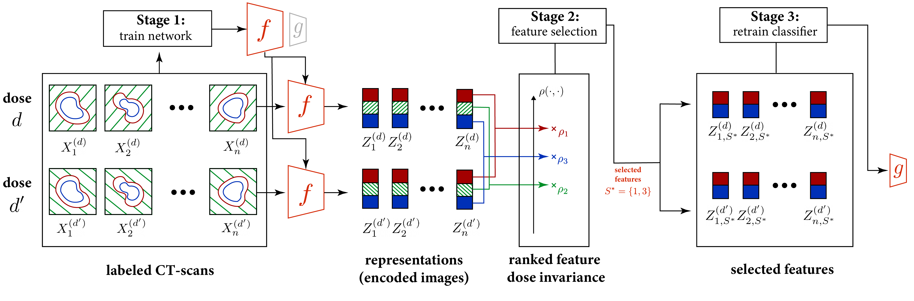

# Dose Invariant Feature Selection

<div align="center">

</div>
<div align="center"> </div>

## Using invariances to overcome dose related sample distribution shifts and spurious correlation
We propose a novel methodology for selecting deep-learning models targeting pulmonary fibrosis staging in CT scans. The key method to achieve this robustness is to select only those features from the representations of CT scans that are *invariant* to the dose. The resulting representations of CT scans recorded with different doses must resemble samples originating from the same distribution.

Our method overcomes X-ray dose-related sample distribution shifts and spurious correlations without relying on model retraining or computational intensive training schemes. 

In all our settings, we beat the state of the art by at least 6% in the F1 score when the training and test dose difference. 

## Code Structure
This project integrates hydra and pytorch lighnting for fast prototyping and reliable experiment replication. 
For more details on how to setup the logging and general project structure check https://github.com/ashleve/lightning-hydra-template.

```
.
├── configs/                   # hydra configuration files for the main architecture
├── configs_class/             # hydra configuration files for the classifier fine-tuning
├── configs_fs/                # hydra configuration files feature selection
├── data/                      # data folder with example of 10 fold cross validation split
├── figs/                      # figures from the paper
├── logs/                      # logs directory for model checkpoints and training logging
├── src/
     ├── datamodules           # Pytorch/PytorchLightning specific modules for the datasets anda dataloaders
     ├── feature_selection     # Pytorch/PytorchLightning specific modules for the datasets anda dataloaders
     		├──helpers.py      # generic module with helper functions for code cleaning purposes
     		├──methods.py      # main methods and similarity functions for feature selection
     ├── models                # building blocks and parent LightningModule for all models
     ├── utils.py              # utility with helper functions
 ├── train.py                  # generic hydra training script
 ├── test.py                   # generic hydra testing script
 ├── select_features.py        # sript to select features
 ├── train_classifier.py       # generic training script for final classifier training
 ├── requirements.txt
 ├── LICENSE
 └── README.md
```

## Reproducibility
To reproduce the results obtained in _____ you will first need to install [PyTorch](pytorch.org) and [PyTorchLightning](https://github.com/PyTorchLightning/pytorch-lightning).


To install all the requirements use:

```bash
pip install -r requirements.txt
```

To create all experiment configuration files used in this work change the *data_dir* variable in *setup_configs.py* and run:

```bash
python setup_configs.py
```

To run a specific experiment use:
```bash
python train.py  experiment=EXPERIMENT_NAME name=NAME_USER_FOR_LOGGING 
python select_features.py  experiment=EXPERIMENT_NAME name=NAME_USER_FOR_LOGGING 
python train_classifier.py  experiment=EXPERIMENT_NAME name=NAME_USER_FOR_LOGGING 

```


## How to setup the dataset?

This dataset is an in-house dataset. Please contact the authors for access to the original data. 
To experiment with a new dataset follow the examples provided in './src/datamodules'
